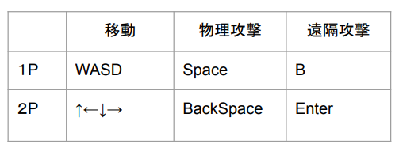

# python_final_project
Code Chrysalis　Python基礎講座　final project teamサーモンのプロジェクトです。


サーモン、サメ、ヒラメ、タコ、イカ、ロブスターの6種類の魚が、海の中で格闘するゲーム, Aqua Brawlを作成しました。一つのキーボードを共有しながら、２人でのリアル対戦を行うことができます。

発表に用いた資料は、``document/Aqua Brawl.pdf``　です。ゲームの特徴や操作方法、工夫点などを記載しています。

## セットアップ
1. pygame のインストール
    ```
    pip install pygame
    ```

2. 以下を実行し、main.pyの実行を行うと、別ウインドウでpygameが開きます
    ```
    python main.py
    ```

## ゲームの実行方法
Player1は、WASDキー、Player2は矢印キーでキャラクターを選択後、Enterキーでゲーム開始

## ゲーム中の操作方法

